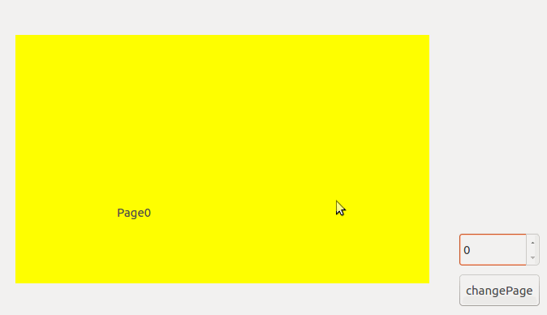

# translation
这是一个基于Qt Widget开发的平移组件，主要应用在嵌入式触摸显示屏上，通过手触滑动切换页面显示。
## 示例:

## 功能概述:
该组件本质上是一个容器，使用时只需将要实现平移效果的界面列表(widgetList)传递给该容器。容器内部对鼠标事件(按下,移动,释放)进行不同的算法处理，最终通过move()完成内部部件的平移，并在鼠标释放时结合Qt动画实现缓和的滑动效果。  
经测试该组件在触摸屏上实现了滑动切换页面的效果，但效果相对移动手机界面的滑动还是弱了些。此外该组件也留出了几个对外接口，可以在外部直接调用完成页面的切换，同时还提供一个信号，向外界报告状态迁移的结果，外部可以根据信号做一些界面切换的逻辑处理。  
## 代码接口:
该组件的所有功能主要由一个类TranslationWidget实现，只需在类对象初始化时传递平移部件的列表即可。对外提供了如下接口：
```
//获取当前页的索引
int getCurrentPageIndex(){return currentPageIndex;}

//获取当前页
QWidget *getCurrentPage(){return widgetList.at(currentPageIndex);}

//设置当前显示页，第二个参数表示页面切换是否展示动画效果
void setCurrentPage(int index,bool isAnimation=false);

//获取/设置当前组件是否可以通过鼠标拖动平移，当禁用掉平移功能后，该组件则可以作为一个淡入淡出的动画容器。
bool getMoveEnabled(){return moveEnabled;}
void setMoveEnabled(bool moveEnabled);
```
## 作者联系方式:
**邮箱:justdoit_mqr@163.com**  
**新浪微博:@为-何-而来**  
